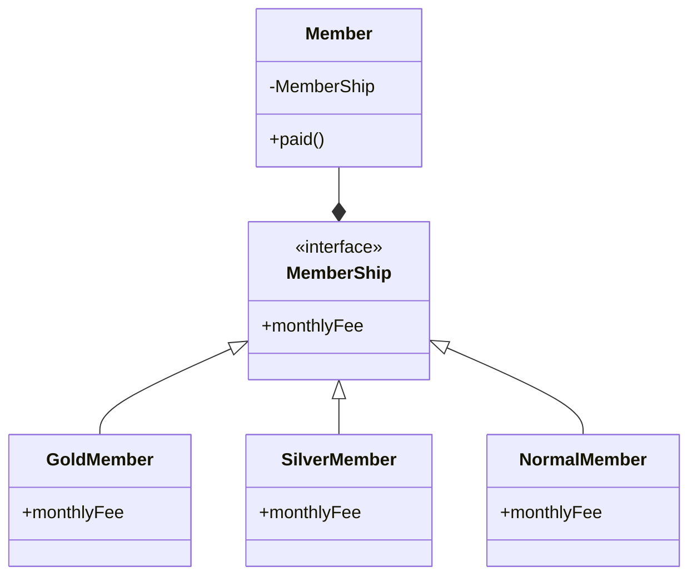

## 概要
アルゴリズム（＝具体的な処理、手続きの内容）をクラス内にカプセル化して
クライアント（＝利用者側）からはインターフェースを利用する形にすることで
アルゴリズムとクライアントを疎結合にする。
その結果、以下のような柔軟な設計ポイントが享受できる
- 利用者側の変更とアルゴリズムの変更が互いに影響し合わない
- アルゴリズムの変更や追加が他のアルゴリズムに影響しない
- 利用者側のアルゴリズムを実行時に変更可能（※ストラテジーパターン名称の由来）

## UML
